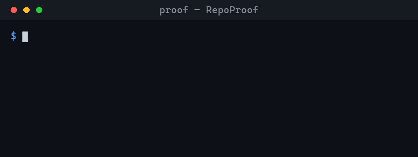

<a id="readme-top"></a>

<!--
  RepoProof README. Modeled on the Best-README-Template
  (https://github.com/othneildrew/Best-README-Template) — kept deliberately honest:
  no AI-generated banner, and every console block below is REAL output from the tool.
-->

<div align="center">

[![CI][ci-shield]][ci-url]
[![License: MIT][license-shield]][license-url]
[![Python][python-shield]][python-url]
[![Tests][tests-shield]][ci-url]
[![Coverage][coverage-shield]][ci-url]
[![Claude Code skill][claude-shield]][claude-url]
[![PRs Welcome][prs-shield]][prs-url]

[![Stars][stars-shield]][stars-url]
[![Forks][forks-shield]][forks-url]
[![Issues][issues-shield]][issues-url]

<br />

<h1>🔬 RepoProof</h1>

<h3>Verified READMEs + real demos for Claude Code</h3>

<p align="center">
  <b>Other tools make a repo <i>look</i> finished. RepoProof makes it <i>provably work</i> — and shows it.</b>
  <br />
  It runs your README quickstart in a sandbox, fixes the docs when they're wrong,
  <br />
  refuses to hide a real bug, and captures a real demo of the thing running.
  <br />
  <br />
  <a href="#usage"><strong>Explore the docs »</strong></a>
  <br />
  <a href="#-see-it-run-real-output">View Demo</a>
  &middot;
  <a href="https://github.com/ssamba1/repo-proof/issues/new">Report Bug</a>
  &middot;
  <a href="https://github.com/ssamba1/repo-proof/issues/new">Request Feature</a>
</p>

<br />



<sub><i>Real output — generated by running the tool (<a href="tools/gen_demo.py">tools/gen_demo.py</a>), not a mockup.</i></sub>

</div>

---

<details>
  <summary><b>Table of Contents</b></summary>
  <ol>
    <li><a href="#about-the-project">About The Project</a></li>
    <li><a href="#-see-it-run-real-output">See It Run (real output)</a></li>
    <li><a href="#the-integrity-rule">The Integrity Rule</a></li>
    <li><a href="#how-it-works">How It Works</a></li>
    <li><a href="#built-with">Built With</a></li>
    <li>
      <a href="#getting-started">Getting Started</a>
      <ul>
        <li><a href="#prerequisites">Prerequisites</a></li>
        <li><a href="#installation">Installation</a></li>
        <li><a href="#quick-start">Quick start</a></li>
      </ul>
    </li>
    <li><a href="#usage">Usage</a></li>
    <li><a href="#using-it-inside-claude-code">Using It Inside Claude Code</a></li>
    <li><a href="#why-repoproof-is-different">Why RepoProof Is Different</a></li>
    <li><a href="#safety--security">Safety &amp; Security</a></li>
    <li><a href="#roadmap">Roadmap</a></li>
    <li><a href="#contributing">Contributing</a></li>
    <li><a href="#license">License</a></li>
    <li><a href="#acknowledgments">Acknowledgments</a></li>
  </ol>
</details>

---

## About The Project

A README's job is to turn a stranger into a user. Most repo-polish tools optimize the wrong
thing: they generate a `LICENSE`, stuff keywords into the description, and paste an AI-generated
banner — making a repo *look* complete while its quickstart may not even run and its "demo" is a
fantasy image.

**RepoProof inverts that.** It is a [Claude Code](https://claude.com/claude-code) skill that
earns trust instead of faking polish:

- 🔬 **`/proof verify`** — extracts the README quickstart (install + first run command), runs it
  in a disposable sandbox, and tells you whether it *actually works*. If a command is wrong
  because the **docs** are wrong, it fixes it and re-verifies. If the **code** is broken, it says
  so — and never rewrites the README to hide it.
- 🎬 **`/proof demo`** — captures a **real** demo of the project running: a terminal GIF (via
  [vhs](https://github.com/charmbracelet/vhs)) or a web screenshot (via Playwright), with a real
  text-transcript fallback. Never a fabricated banner.

The boilerplate (LICENSE, CONTRIBUTING, templates) is table stakes that Claude Code already
generates for free — RepoProof leads with the part nobody else does: **proof**.

<p align="right">(<a href="#readme-top">back to top</a>)</p>

## 🎬 See It Run (real output)

> Every block below is **real, unedited output** from RepoProof — captured by running it, not
> mocked up. (Dogfooding: this is literally what the tool prints.)

**A quickstart that works** → `verified`:

```console
$ proof verify ./my-project

# RepoProof — verify ✅
**Result:** verified — Quickstart verified — runs as written.
**Project:** python / cli

## Steps
- `python main.py` — ok (0.047s, subprocess)

_exit code: 0_
```

**A README with a typo'd filename** → detected, corrected, **re-verified** → `fixed`:

```console
$ proof verify ./project-with-doc-typo

# RepoProof — verify 🔧
**Result:** fixed — Quickstart fixed — a documentation error was corrected and re-verified.

## Proposed README edit
- python man.py
+ python main.py

## Notes
- Corrected README command on line 9: `python man.py` -> `python main.py` (verified to exit 0).

_exit code: 0_
```

**A correct command but broken code** → reported, **never masked** → `real_code_bug`:

```console
$ proof verify ./project-that-wont-compile

# RepoProof — verify ❌
**Result:** real_code_bug — Quickstart fails because the project's own code is broken.
**Project:** rust / cli

## Steps
- `cargo run` — exit 101 (0.203s, subprocess)

_exit code: 2
```

**A real demo, captured (not generated):**

```console
$ proof demo ./my-cli
demo captured [text-fallback] -> docs/proof-demo.md

## Demo
$ python main.py
Hello from my-cli
```

<p align="right">(<a href="#readme-top">back to top</a>)</p>

## The Integrity Rule

This is the whole point of the project, so it gets its own section.

A failing quickstart has **two very different causes**, and RepoProof keeps them apart:

| Cause | Example | What RepoProof does |
|-------|---------|---------------------|
| **Documentation error** | README says `python man.py`, the file is `main.py` | Corrects it, **re-runs to confirm**, reports `fixed` |
| **Real code bug** | The command is right; the program crashes / won't compile | Reports `real_code_bug` and **never** edits the README to hide it |

> A tool that quietly rewrites a README to make a broken project look green is the problem, not
> the solution. RepoProof will never weaken an example (`|| true`, pinning to an ancient version,
> deleting an assertion) to manufacture a passing result.

<p align="right">(<a href="#readme-top">back to top</a>)</p>

## How It Works

```text
README ──▶ extract ──▶ sandbox run ──▶ assert ──▶ classify ──▶ report
           (fenced     (disposable     (exit 0?)   doc-error?   verified / fixed /
            blocks,      copy, Docker               vs           real_code_bug / needs_* /
            injection-   or subprocess,             code-bug)    extraction_failed / timeout
            resistant)   scrubbed env)              │
                                                    └─ doc typo ─▶ fix ─▶ re-run ─▶ fixed
```

Nine terminal outcomes, each mapped to a CI exit code (see [Usage](#usage)). The README is
treated as **untrusted data** — only fenced code blocks are parsed, commands are split with
`shlex` (never `shell=True`), and pipe-to-shell constructs are refused.

<p align="right">(<a href="#readme-top">back to top</a>)</p>

## Built With

[![Python][python-badge]][python-url]
[![pytest][pytest-badge]][pytest-url]
[![Ruff][ruff-badge]][ruff-url]
[![Docker][docker-badge]][docker-url]
[![GitHub Actions][actions-badge]][actions-url]

Zero runtime dependencies. Pure-Python deterministic core + the Agent Skills standard. Docker,
vhs, and Playwright are optional and degrade gracefully when absent.

<p align="right">(<a href="#readme-top">back to top</a>)</p>

## Getting Started

### Prerequisites

- **Python 3.10+** (required).
- **Optional**, only if present — used when available, skipped cleanly when not:
  - Docker (preferred sandbox isolation)
  - Node / Rust / Go toolchains (to verify those ecosystems)
  - [`vhs`](https://github.com/charmbracelet/vhs) (CLI demo GIFs)
  - Playwright (`pip install 'repo-proof[web]'`) for web screenshots

### Installation

```bash
git clone https://github.com/ssamba1/repo-proof.git
cd repo-proof
bash install.sh        # macOS / Linux   (Windows: ./install.ps1)
```

The installer copies three skills into `~/.claude/skills/` (`proof`, `proof-verify`,
`proof-demo`) and **writes nothing else** — no `curl | bash`, no credentials, no telemetry,
nothing outside `~/.claude`.

**Or install as a Claude Code plugin:**

```
/plugin marketplace add ssamba1/repo-proof
/plugin install repo-proof@repo-proof
```

Want a bare `proof` command on your PATH instead? `pip install .` (or `pipx install .`).

### Quick start

Confirm the verifier runs:

```bash
python -m proof.scripts.cli verify --help
```

Then point it at any repo — see [Usage](#usage).

<p align="right">(<a href="#readme-top">back to top</a>)</p>

## Usage

Three ways to run it; pick whichever fits.

**1. Inside Claude Code (recommended)** — after `install.sh`, just ask:

```
/proof verify
/proof demo
```

**2. Direct, from a clone** — target any repo by path:

```bash
python -m proof.scripts.cli verify path/to/repo
python -m proof.scripts.cli demo path/to/repo
```

**3. From the installed skill** — works from any directory:

```bash
python "$HOME/.claude/skills/proof/run.py" verify path/to/repo   # %USERPROFILE% on Windows
```

### Flags

| Flag | Effect |
|------|--------|
| `--json` | Machine-readable report (+ CI exit code) |
| `--write` | Apply a proposed documentation fix in place (off by default) |
| `--no-fix` | Report only; never propose a correction |
| `--mode auto\|docker\|subprocess` | Sandbox mode (auto = Docker when available) |
| `--timeout <seconds>` | Per-step time budget |
| `--web <url>` | (`demo`) screenshot a running web app |

### Exit codes (for CI gates)

| Code | Outcome |
|------|---------|
| `0` | `verified`, `fixed`, or legitimately skipped (`needs_input` / `needs_services` / `sandbox_unavailable`) |
| `1` | `unfixable_doc_error` |
| `2` | `real_code_bug` |
| `3` | `extraction_failed` (no quickstart found) |
| `4` | `timeout` |

<p align="right">(<a href="#readme-top">back to top</a>)</p>

## Using It Inside Claude Code

RepoProof ships as three [Agent Skills](https://claude.com/claude-code):

| Skill | Trigger | Does |
|-------|---------|------|
| **`proof`** | "/proof", "verify this README" | Orchestrator — routes intent and interprets results |
| **`proof-verify`** | "does the quickstart work?", "/proof verify" | Runs + verifies the quickstart, fixes docs, flags real bugs |
| **`proof-demo`** | "record the CLI", "/proof demo" | Captures a real GIF / screenshot / transcript |

After `install.sh`, Claude Code auto-loads them. Ask it to *"verify my README quickstart"* or
*"make a demo for this repo"* and it runs the deterministic core, reads the structured outcome,
and tells you what it found — applying README edits only with your go-ahead.

<p align="right">(<a href="#readme-top">back to top</a>)</p>

## Why RepoProof Is Different

The idea isn't unique — the pieces are commoditized. The **combination** is unoccupied:

| Capability | Existing tools | What RepoProof adds |
|------------|----------------|---------------------|
| Run README code in CI | Runme, byexample, doctest, mdbook test | Infers the quickstart from **arbitrary prose** — zero annotation/config |
| Report pass/fail | Runme, readme-to-test | **Auto-fixes** the broken command and re-runs (repair loop) |
| Record a demo | vhs, asciinema, Playwright | Auto-detects type and captures **in the same pass** |
| Beautify a repo | AI README/banner generators | **Verifies** instead of generating; never ships unverified commands or AI-slop banners |

Honest about the moat: any general agent *can be prompted* to do this once. RepoProof's value is
**reliability + DX** — it works repeatably on any repo without re-engineering the prompt each time.

<p align="right">(<a href="#readme-top">back to top</a>)</p>

## Benchmarks

The core claim — *zero-config extraction from arbitrary prose* — is measured, not asserted.
[`tools/benchmark.py`](tools/benchmark.py) runs the extractor against 16 popular real-world
repos (httpie, requests, ripgrep, fzf, express, …). Honest result: **~9/16** extracted the exact
intended quickstart and **4/16** were correctly identified as install-only (libraries with no
shell run), so **~13/16 handled correctly** (up from ~6/16 before the extractor was hardened
against this corpus). The remaining miss is a README that buries usage beneath a long install
matrix — a tracked limitation, not a hidden one.

Full results and methodology: [`docs/benchmark.md`](docs/benchmark.md). Reproduce with
`python tools/benchmark.py`.

<p align="right">(<a href="#readme-top">back to top</a>)</p>

## Safety & Security

- **Run on a copy.** Quickstarts execute in a disposable temp copy of the repo (excluding
  `.git`, `node_modules`, `target`, `.venv`, …), torn down even on crash/timeout. Your working
  tree is never modified or polluted.
- **Hardened sandbox.** Docker mode runs with `--cap-drop ALL --pids-limit --memory --cpus
  --security-opt no-new-privileges`. Subprocess fallback is flagged in every result.
- **Secret-scrubbed env.** The child gets your environment **minus** secret-shaped variables
  (`*_TOKEN`, `*_KEY`, `*_SECRET`, `AWS_*`, `GH_*`, `OPENAI*`, …) — credentials never reach
  untrusted code.
- **README is data, not instructions.** Only fenced code blocks are parsed; `curl … | sh` and
  `rm -rf /` are refused.
- **This repo guards itself.** A tracked pre-commit hook (`.githooks/pre-commit`) blocks
  credential-shaped content and secret filenames. Enable with `git config core.hooksPath .githooks`.

<p align="right">(<a href="#readme-top">back to top</a>)</p>

## Roadmap

- [x] `verify`: extract → sandbox → classify → fix loop (9 outcomes, CI exit codes)
- [x] Integrity: doc-error vs `real_code_bug` separation
- [x] `demo`: real GIF / text transcript / web screenshot
- [x] Docker + subprocess sandbox, secret-scrubbed env, run-on-copy
- [x] Python / Node / Rust / Go detection; CI on Ubuntu + Windows
- [ ] Doc-code **drift guard** (CI action that fails when docs diverge from code)
- [ ] Web demo **auto-boot** (port discovery + readiness, no `--web` needed)
- [ ] Benchmark corpus (extraction-success + false-fix rate across N real repos)
- [ ] More ecosystems (Ruby, Java, .NET)

See the [open issues](https://github.com/ssamba1/repo-proof/issues) for the full list.

<p align="right">(<a href="#readme-top">back to top</a>)</p>

## Contributing

Contributions make the open-source community better. Any contribution is **greatly appreciated**.

1. Fork the project
2. Create your branch (`git checkout -b feature/amazing`)
3. `git config core.hooksPath .githooks` (enables the secret-blocker)
4. Make changes; ensure `ruff check .`, `ruff format --check .`, and `pytest` all pass
5. Commit (`git commit -m 'feat: amazing'`) and open a PR

See [CONTRIBUTING.md](CONTRIBUTING.md). The dogfood test verifies this very README — if you edit
the Quick start, keep it runnable.

<p align="right">(<a href="#readme-top">back to top</a>)</p>

## License

Distributed under the MIT License. See [`LICENSE`](LICENSE). Not affiliated with Anthropic or
GitHub, Inc.

<p align="right">(<a href="#readme-top">back to top</a>)</p>

## Acknowledgments

- [Best-README-Template](https://github.com/othneildrew/Best-README-Template) — structure
- [Runme](https://runme.dev) & [byexample](https://byexamples.github.io) — prior art in executable docs
- [vhs](https://github.com/charmbracelet/vhs) — terminal GIFs
- [Shields.io](https://shields.io) — badges
- [Claude Code](https://claude.com/claude-code) — the platform this skill runs on

<p align="right">(<a href="#readme-top">back to top</a>)</p>

<!-- MARKDOWN LINKS & IMAGES -->
[ci-shield]: https://img.shields.io/github/actions/workflow/status/ssamba1/repo-proof/ci.yml?branch=main&label=CI&logo=githubactions&logoColor=white
[ci-url]: https://github.com/ssamba1/repo-proof/actions/workflows/ci.yml
[license-shield]: https://img.shields.io/github/license/ssamba1/repo-proof?color=blue
[license-url]: https://github.com/ssamba1/repo-proof/blob/main/LICENSE
[python-shield]: https://img.shields.io/badge/python-3.10%2B-3776AB?logo=python&logoColor=white
[python-url]: https://www.python.org
[tests-shield]: https://img.shields.io/badge/tests-67%20passing-brightgreen?logo=pytest&logoColor=white
[coverage-shield]: https://img.shields.io/badge/coverage-88%25-brightgreen
[claude-shield]: https://img.shields.io/badge/Claude%20Code-skill-D97757?logo=anthropic&logoColor=white
[claude-url]: https://claude.com/claude-code
[prs-shield]: https://img.shields.io/badge/PRs-welcome-brightgreen
[prs-url]: https://github.com/ssamba1/repo-proof/pulls
[stars-shield]: https://img.shields.io/github/stars/ssamba1/repo-proof?style=social
[stars-url]: https://github.com/ssamba1/repo-proof/stargazers
[forks-shield]: https://img.shields.io/github/forks/ssamba1/repo-proof?style=social
[forks-url]: https://github.com/ssamba1/repo-proof/network/members
[issues-shield]: https://img.shields.io/github/issues/ssamba1/repo-proof
[issues-url]: https://github.com/ssamba1/repo-proof/issues
[python-badge]: https://img.shields.io/badge/Python-3776AB?logo=python&logoColor=white
[pytest-badge]: https://img.shields.io/badge/pytest-0A9EDC?logo=pytest&logoColor=white
[pytest-url]: https://pytest.org
[ruff-badge]: https://img.shields.io/badge/Ruff-D7FF64?logo=ruff&logoColor=black
[ruff-url]: https://docs.astral.sh/ruff
[docker-badge]: https://img.shields.io/badge/Docker-2496ED?logo=docker&logoColor=white
[docker-url]: https://www.docker.com
[actions-badge]: https://img.shields.io/badge/GitHub%20Actions-2088FF?logo=githubactions&logoColor=white
[actions-url]: https://github.com/features/actions
